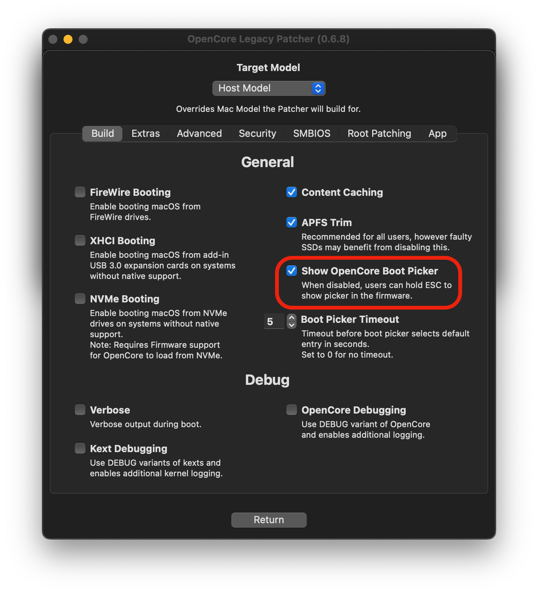
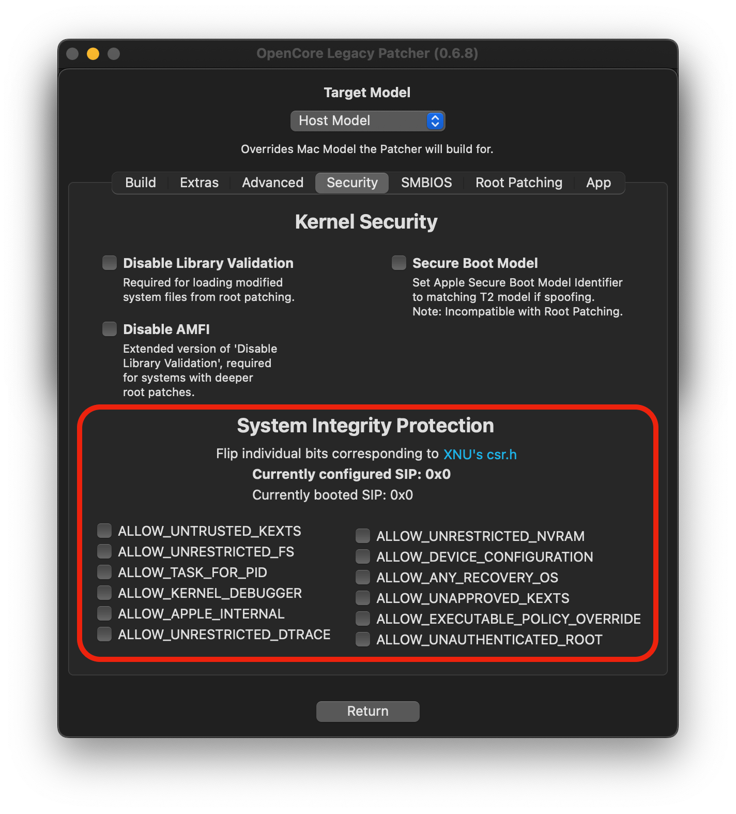
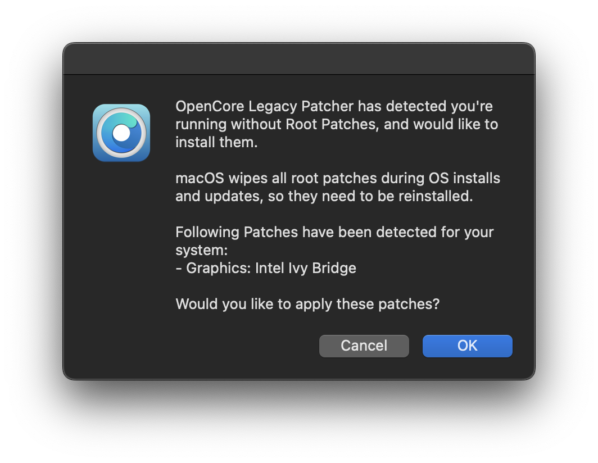
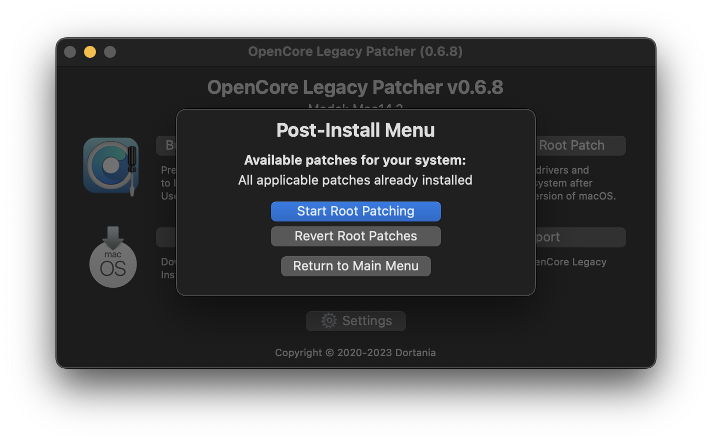
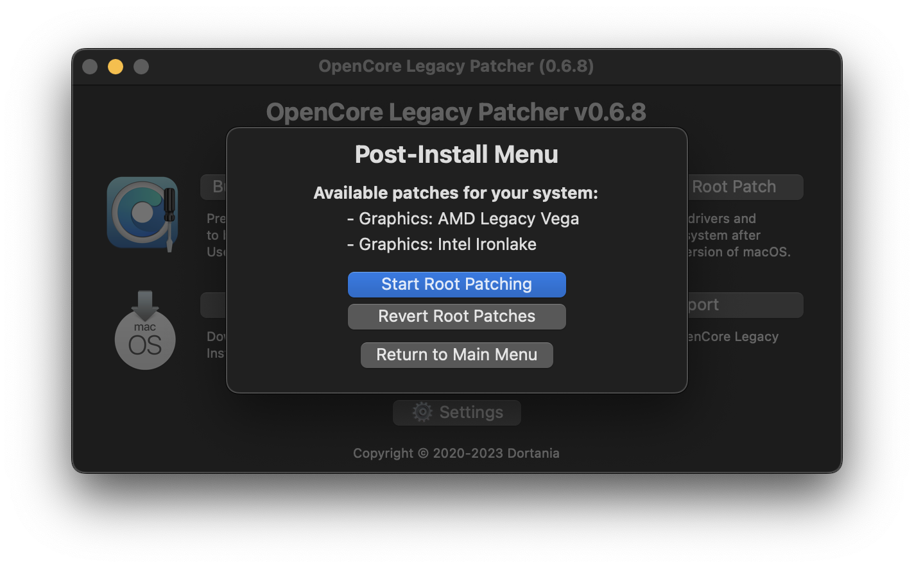

# Post-Installation

* [Booting without USB drive](#booting-without-usb-drive)
* [Booting seamlessly without Boot Pickers](#booting-seamlessly-without-boot-pickers)
* [Applying Post Install Volume Patches](#applying-post-install-volume-patches)

## Booting without USB drive

Once you've installed macOS through OpenCore, you can boot up and go through the regular install process. To boot without the USB drive plugged in is quite simple:

* Download OpenCore Legacy Patcher
* Change Patcher settings as you'd like
* Build OpenCore again
* Install OpenCore to internal drive
* Reboot holding Option, and select the internal EFI

And voila! No more USB drive required.

## Booting seamlessly without Boot Pickers

To do this, run the OpenCore Legacy Patcher and head to Patcher Settings, then uncheck "Show OpenCore Boot Picker" on the Build tab:

Once you've toggled it off, build your OpenCore EFI once again and install to your desired drive. Now to show the OpenCore selector, you can simply hold down the "ESC" key while clicking on EFI boot, and then you can release the "ESC" key when you see the cursor arrow at the top left.

## Enabling SIP (System Integrity Protection)

For many users, SIP will be lowered by default on build. For Intel HD 4000 users, you may have noticed that SIP is partially disabled. This is to ensure full compatibility with macOS Monterey and allow seamless booting between it and older OSes. However for users who don't plan to boot Monterey, you can re-enable under Patcher Settings.

Note: Machines running macOS Ventura or systems with non-Metal GPUs can't enable SIP outright, due to having a patched root volume. Enabling it will brick the installation.

Going forward with 0.6.6, SIP settings can be accessed from the Security tab shown in the images.

| SIP Enabled | SIP Lowered (Root Patching) | SIP Disabled |
| :--- | :--- | :--- |
|  |  |  |

:::warning

If you're unsure whether you should enable SIP, leave it as-is. Systems where you've already ran the Post Install Root Patching can't enable SIP without potentially breaking the current install.

:::

## Applying Post Install Volume Patches

:::warning

If you need to use Migration Assistant to bring over data to your new macOS install, it's **highly recommended** to avoid restoring from inside Setup Assistant and waiting to install root patches until after the transfer is complete. If root patches were automatically installed, you can use the options available in the OpenCore Legacy Patcher app to remove them.

Using Migration Assistant while patches are installed can lead to an unbootable system, requiring a reinstall of macOS.

:::

Post Install Volume Patches, sometimes also called root patches, are patches that have to be installed to disk for some older Macs to gain back functionality.

OpenCore Legacy Patcher will automatically root patch your system during a first time install **if the USB install media was created within OpenCore Legacy Patcher.** Users will also be prompted to install these patches after macOS updates or whenever patches aren't detected on the system. We recommend rebuilding OpenCore with the latest version to take advantage of these new features.

Users can also see whether applicable patches have been installed, date and version the system was root patched with in the Post-Install Menu.

| Automatic install prompt | Status |
| :--- | :--- |
|  |  |

### Running Post Install patches manually

If you need to run the patcher manually, you can do so with the app. There's no harm in trying to run the Patcher, as without compatible hardware, nothing will be done. You can see below on whether your hardware needs root volume patching or not.

There's also an option to remove root patches, which may be required in some situations, such as switching GPUs in Mac Pros or using Migration Assistant.

| Listing Patches | Patching Finished |
| :--- | :--- |
|  |  |

:::warning

With macOS Ventura and Macs with AMD Legacy GCN GPUs (ie. Metal), Root Patching requires a network connection to grab Apple's Kernel Debug Kit to start root patching. If your system is unable to connect to the internet, you can manually download a KDK from Apple's site:

* [Apple's Developer Download Page](https://developer.apple.com/download/all/?q=Kernel%20Debug%20Kit)

Grab the Kernel Debug Kit whose version is closest to the OS you installed, and install it to the machine running Ventura.

Machines that require this are those with AMD Metal dGPUs:
* 2008 - 2013 Mac Pros (MacPro3,1 - 6,1)
* 2009 - 2016 iMacs (iMac10,1 - 17,1)
* 2015 15" MacBook Pro with a dGPU (MacBookPro11,5)

:::

Below entries represent GPUs no longer natively supported, ie. requiring root volume patching with OpenCore Legacy Patcher:

:::details GPUs requiring patching in macOS Big Sur and newer

* NVIDIA:
  * Tesla (8000 - 300 series)
* AMD:
  * TeraScale (2000 - 6000 series)
* Intel:
  * Iron Lake
  * Sandy Bridge (2000 - 3000 series)

:::

:::details GPUs requiring patching in macOS Monterey and newer

* NVIDIA:
  * Tesla (8000 - 300 series)
  * Kepler (600 - 800 series)
* AMD:
  * TeraScale (2000 - 6000 series)
* Intel:
  * Iron Lake
  * Sandy Bridge (2000 - 3000 series)
  * Ivy Bridge (4000 series)

:::

:::details Wireless Cards requiring patching in macOS Monterey and newer

* Broadcom:
  * BCM94328
  * BCM94322
* Atheros

:::

:::details GPUs requiring patching in macOS Ventura and newer

* NVIDIA:
  * Kepler (600 - 800 series)
* AMD:
  * GCN 1-3 (7000 - R9 series)
  * Polaris (RX 4xx/5xx series, if CPU lacks AVX2)
* Intel:
  * Ivy Bridge (4000 series)
  * Haswell (4400, 4600, 5000 series)
  * Broadwell (6000 series)
  * Skylake (500 series)

:::
