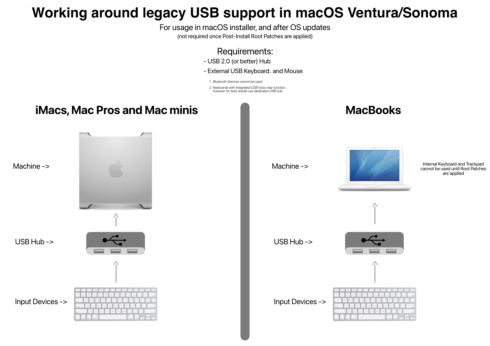

# Troubleshooting

Here are some common errors that users may experience while using this patcher:

* [OpenCore Legacy Patcher not launching](#opencore-legacy-patcher-not-launching)
* [Stuck on `This version of Mac OS X isn't supported on this platform` or (🚫) Prohibited Symbol](#stuck-on-this-version-of-mac-os-x-isn't-supported-on-this-platform-or-(🚫)-prohibited-symbol)
* [Can't boot macOS without the USB](#can't-boot-macos-without-the-usb)
* [Infinite recoveryOS Booting](#infinite-recoveryos-booting)
* [Stuck on boot after root patching](#stuck-on-boot-after-root-patching)
* [Reboot when entering Hibernation (`Sleep Wake Failure`)](#reboot-when-entering-hibernation-sleep-wake-failure)
* [How to Boot recoveryOS through OpenCore Legacy Patcher](#how-to-boot-recoveryos-through-opencore-legacy-patcher)
* [Stuck on "Your Mac needs a firmware update"](#stuck-on-your-mac-needs-a-firmware-update)
* [No Brightness Control](#no-brightness-control)
* [No Graphics Acceleration](#no-graphics-acceleration)
* [Black Screen on MacBookPro11,3 in macOS Monterey](#black-screen-on-macbookpro113-in-macos-monterey)
* [No DisplayPort Output on Mac Pros with NVIDIA Kepler](#no-displayport-output-on-mac-pros-with-NVIDIA-kepler)
* [Volume Hash Mismatch Error](#volume-hash-mismatch-error)
* [Can't Disable SIP in recoveryOS](#can't-disable-sip-in-recoveryos)
* [Stuck on "Less than a minute remaining…"](#stuck-on-less-than-a-minute-remaining)
* [No acceleration after a Metal GPU swap on Mac Pro](#no-acceleration-after-a-metal-gpu-swap-on-mac-pro)
* [Keyboard, Mouse and Trackpad not working in installer or after update](#keyboard-mouse-and-trackpad-not-working-in-installer-or-after-update)


## OpenCore Legacy Patcher not launching

If the application won't launch (e.g. icon will bounce in the Dock), try launching it via Terminal by typing the following command, make sure you've moved the app to `/Applications` before this.

```sh
/Applications/OpenCore-Legacy-Patcher.app/Contents/MacOS/OpenCore-Legacy-Patcher
```

## Stuck on `This version of Mac OS X isn't supported on this platform` or (🚫) Prohibited Symbol

This means macOS has detected an SMBIOS it doesn't support. To resolve this, ensure you select `EFI Boot` **first**.

Once you've booted OpenCore at least once, your hardware should now auto-boot it until either an NVRAM reset occurs, or you remove the drive with OpenCore installed.

However, if the 🚫 Symbol only appears after the boot process has already started (the bootscreen appears/verbose boot starts), it could mean that your USB drive has failed to pass macOS' integrity checks. To resolve this, create a new installer using a different USB drive (preferably of a different model.)

## Can't boot macOS without the USB

By default, the OpenCore Legacy Patcher won't install OpenCore onto the internal drive itself during installs.

After installing macOS, OpenCore Legacy Patcher should automatically prompt you to install OpenCore onto the internal drive. However, if it doesn't show the prompt, you'll need to Build and Install OpenCore again and select your internal drive.

Reminder that once this is done, you'll need to select `EFI Boot` in the Mac Boot Picker again for your hardware to remember this entry and auto boot from then on.

## Infinite recoveryOS Booting

OpenCore Legacy Patcher rely on Apple Secure Boot to ensure OS updates work correctly and reliably. However this installs NVRAM variables that will confuse your Mac if not running with OpenCore. To resolve this, simply uninstall OpenCore and [reset NVRAM](https://support.apple.com/en-mide/HT201255).

* Note: Machines with modified root volumes will also result in an infinite recoveryOS loop until integrity is restored.

## Stuck on boot after root patching

Boot into recoveryOS by pressing `Space` in the OpenCore Boot Picker (if you've it hidden, hold `esc` while starting up).

* **Note:** If your disk name is something other than "Macintosh HD", make sure to change the path accordingly. You can figure out your disk name by typing `ls /Volumes`.

Go into terminal and first mount the disk by typing
```sh
mount -uw "/Volumes/Macintosh HD"
```
Then revert the snapshot
```sh
bless --mount "/Volumes/Macintosh HD" --bootefi --last-sealed-snapshot
```
After that, remove problematic kexts
```sh
find "/Volumes/Macintosh HD/Library/Extensions" -name "*.kext" -not -name "HighPoint*" -not -name "SoftRAID*" -exec rm -rf {} \
```

Then restart and now your system should be restored to the unpatched snapshot and should be able to boot again.


## Reboot when entering Hibernation (`Sleep Wake Failure`)

[Known issue on some models](https://github.com/dortania/Opencore-Legacy-Patcher/issues/72), a temporary fix is to disable Hibernation by executing the following command in the terminal:

```
sudo pmset -a hibernatemode 0
```

## How to Boot recoveryOS through OpenCore Legacy Patcher

By default, the patcher will try to hide extra boot options such as recoveryOS from the user. To make them appear, simply press `Space` in the OpenCore Boot Picker to list all boot options.

## Stuck on "Your Mac needs a firmware update"

Full error: "Your Mac needs a firmware update in order to install to this Volume. Please select a Mac OS Extended (Journaled) volume instead."

This error occurs when macOS determines that the current firmware doesn't have full APFS support. To resolve this, when installing OpenCore, head to "Patcher Settings" and enable "Moderate SMBIOS Patching" or higher. This will ensure that the firmware reported will show support for full APFS capabilities.

## No Brightness Control

OpenCore Legacy Patcher supports brightness control on many models. However, some users may have noticed that their brightness keys don't work.

As a work-around, we recommend users try out the below app:

* [Brightness Slider](https://actproductions.net/free-apps/brightness-slider/)

## No Graphics Acceleration

In macOS, GPU drivers are often dropped from the OS with each major release of it. All non-Metal GPUs require additional patches to gain acceleration.

You should have been prompted to install Root Volume patches after the first boot from installation of macOS. If you need to do this manually, you can do so within the patcher app. Once rebooted, acceleration will be re-enabled as well as brightness control for laptops.

## Black Screen on MacBookPro11,3 in macOS Monterey

Due to Apple dropping NVIDIA Kepler support in macOS Monterey, [MacBookPro11,3's GMUX has difficulties switching back to the iGPU to display macOS correctly.](https://github.com/dortania/OpenCore-Legacy-Patcher/issues/522) To work-around this issue, boot the MacBookPro11,3 in Safe Mode and once macOS is installed, run OpenCore Legacy Patcher 's Post Install Root Patches to enable GPU Acceleration for the NVIDIA dGPU.

* Safe Mode can be started by holding `Shift` + `Enter` when selecting macOS in OpenCore Boot Picker.

## No DisplayPort Output on Mac Pros with NVIDIA Kepler

If you're having trouble with DisplayPort output on Mac Pros, try enabling Minimal Spoofing in Settings -> SMBIOS Settings and rebuild/install OpenCore. This will trick macOS drivers into thinking you've a newer MacPro7,1 and resolve the issue.


## Volume Hash Mismatch Error

A semi-common popup some users face is the "Volume Hash Mismatch" error:

<p align="center">

</p>

What this error signifies is that the OS detects that the boot volume's hash doesn't match what the OS is expecting, this error is generally cosmetic and can be ignored. However if your system starts to crash spontaneously shortly after, you'll want to reinstall macOS fresh without importing any data at first.

* Note that this bug affects native Macs as well and isn't due to issues with unsupported Macs: [OSX Daily: "Volume Hash Mismatch" Error in MacOS Monterey](https://osxdaily.com/2021/11/10/volume-hash-mismatch-error-in-macos-monterey/)

Additionally, it can help to disable FeatureUnlock in Settings -> Misc Settings as this tool can be strenuous on systems with weaker memory stability.

## Can't Disable SIP in recoveryOS

With OpenCore Legacy Patcher, the patcher will always overwrite the current SIP value on boot to ensure that users don't brick an installation after an NVRAM reset. However, for users wanting to disable SIP entirely, this can be done easily.

Head into the GUI, go to Patcher Settings, and toggle the bits you need disabled from SIP:

| SIP Enabled                                      | SIP Lowered (Root Patching)                         | SIP Disabled                                      |
|--------------------------------------------------|-----------------------------------------------------|---------------------------------------------------|
|  |  |  |

## Intermediate issues with USB 1.1 and Bluetooth on MacPro3,1 - MacPro5,1

For those experiencing issues with USB 1.1 devices (such as mice, keyboards and bluetooth chipsets), macOS Big Sur and newer have weakened OS-side reliability for the UHCI controller in older Mac Pros.

* UHCI is a USB 1.1 controller that's hooked together with the USB 2.0 ports in your system. Whenever a USB 1.1 device is detected, the UHCI controller is given ownership of the device at a hardware/firmware level.
  * EHCI is the USB 2.0 controller in older Mac Pros

Because of this, we recommend placing a USB 2.0/3.0 hub between your devices and the port on the Mac Pro. UHCI and EHCI can't both be used at once, so using a USB hub will always force the EHCI controller on.

* Alternatively, you can try cold-starting the hardware and see if macOS recognizes the UHCI controller properly.

## Stuck on "Less than a minute remaining…"

A common area for systems to get "stuck", namely for units that are missing the `AES` CPU instruction/older mobile hardware. During this stage, a lot of heavy cryptography is performed, which can make systems appear to be stuck. In reality they're working quite hard to finish up the installation.

Because this step can take a few hours or more depending on drive speeds, be patient at this stage and don't manually power off or reboot your machine as this will break the installation and require you to reinstall. If you think your system has stalled, press the Caps Lock key. If the light turns on, your system is busy and not actually frozen.

## No acceleration after a Metal GPU swap on Mac Pro

If you finished installing macOS with the original card installed (to see s for example) and swapped your GPU to a Metal supported one, you may notice that you're missing acceleration. To fix this, open OpenCore Legacy Patcher and revert root patches to get your Metal-supported GPU work again.

Alternatively, you can remove "AutoPkg-Assets.pkg" from /Library/Packages on the USB drive before proceeding with the installation. To see the folder, enable hidden files with `Command` + `Shift` + `.`

The reason for this is that the autopatcher will assume that you'll be using the original graphics card and therefore does non-Metal patching, which includes removing some drivers for other cards. This causes Metal cards to not accelerate after swapping.

## Keyboard, Mouse and Trackpad not working in installer or after update

For Macs using legacy USB 1.1 controllers, OpenCore Legacy Patcher can only restore support once it has performed root volume patches. Thus to install macOS, you need to hook up a USB hub between your Mac and Keyboard/Mouse.

* For MacBook users, you'll need to find an external keyboard/mouse in addition to the USB hub

More information can be found here:

* [Legacy UHCI/OHCI support in Ventura #1021](https://github.com/dortania/OpenCore-Legacy-Patcher/issues/1021)

Applicable models include:

| Family      | Year                | Model                   | Notes                                                            |
|-------------|---------------------|-------------------------|------------------------------------------------------------------|
| MacBook     | Mid 2010 and older  | MacBook7,x and older    |                                                                  |
| MacBook Air | Late 2010 and older | MacBookAir3,x and older |                                                                  |
| MacBook Pro | Mid 2010 and older  | MacBookPro7,x and older | Excludes MacBook Pro (15- and 17-inch, Mid 2010) (MacBookPro6,x) |
| iMac        | Late 2009 and older | iMac10,x and older      | Excludes iMac (27-inch, Late 2009) with Core i5 / i7 (iMac11,1)  |
| Mac mini    | Mid 2011 and older  | Macmini5,x and older    |                                                                  |
| Mac Pro     | Mid 2010 and older  | MacPro5,x and older     |                                                                  |



