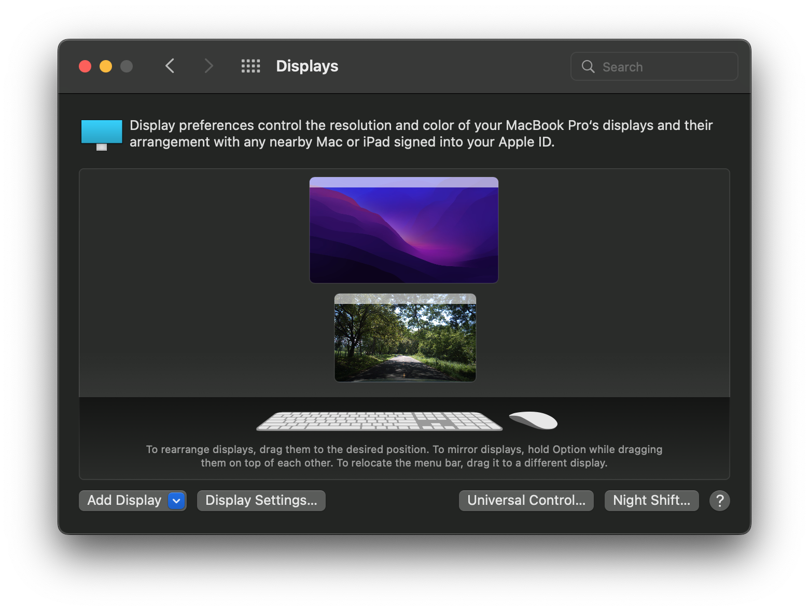
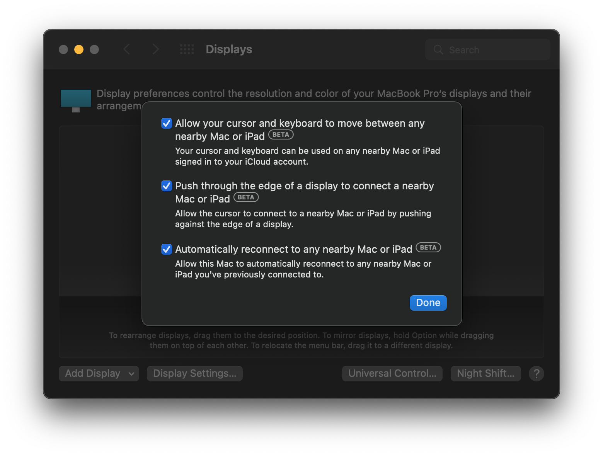
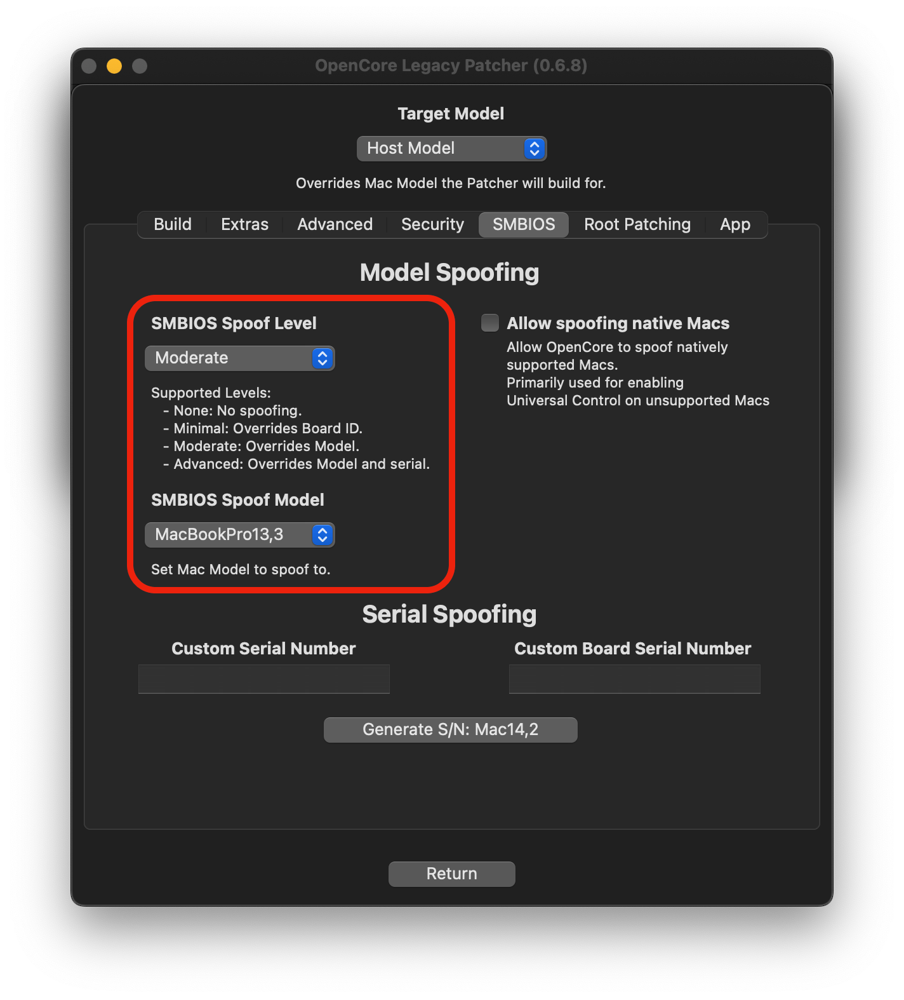

# Universal Control on unsupported Macs

Introduced in macOS 12 Monterey, Universal Control is a feature that allows a Mac to control other Macs and/or iPads, share input devices, and share files across them simultaneously. With OpenCore and FeatureUnlock, Universal Control can be unlocked for most unsupported Macs, as long as they meet the technical requirements listed on this page.

* Note: The following page is primarily for tinkerers, no proper support is provided outside of Discord support (see bottom of page).

## Enabling Universal Control

If you meet all the requirements, in most cases you can go to Display Preferences and tick the Universal Control settings to enable it. If you're planning to use Universal Control with an iPad, make sure to enable Universal Control on the iPad as well.

| Display Preferences | Universal Control settings |
| :--- | :--- |
|  |  |

Most Mac models from 2011 and above should work out of the box. However, older Macs like the 2008-2011 MacBook Pros require upgrading the Wi-Fi/Bluetooth card to a newer model. More info in the [requirements section.](#requirements-for-universal-control)

Some Monterey-native models are blacklisted, check the [blacklisted models section](#blacklisted-models) for more info.

## Requirements for Universal Control

Technical requirements:

* Wi-Fi 4 (802.11n)
* Bluetooth 4.0
* macOS Monterey 12.4 or newer
* iPadOS 15.4 or newer (if applicable)
* OpenCore Legacy Patcher 0.4.3 or newer

Check the [table of models](#table-of-models) below to see whether you need to upgrade hardware and exactly what hardware is required to be changed based on the offending Macs listed. For help on how to upgrade the Wi-Fi card in older 2008-2011 models, refer to the Discord channel [#hardware](https://discord.gg/rqdPgH8xSN) if required.

Other requirements:

* All devices are signed into the same iCloud account.
* Two Factor Authentication is enabled with your Apple ID.
* Bluetooth and WiFi are enabled. Neither needs to be connected, leaving them enabled is sufficient.
* Handoff turned on from iCloud settings.
* The devices in question are in close proximity.

### Table of models

This table shows which models do and do not support Universal Control out of box (OOB) and what is required to gain support.
Note: For AirPort upgrades, only the best/newest cards are listed.

::: details MacBook

|   SMBIOS   | WiFi/BT version | UC OOB  | Comment |
|------------|-----------------|------------|---------|
| MacBook4,1 | Wi-Fi 4 / BT 2.0 EDR |   NO  | Replace stock AirPort card with an mPCIE + USB Connector Adapter board with a BCM94360CS2 card  |
| MacBook5,1 | ^^ |  ^^ |  Use a Broadcom USB Bluetooth 4.0+ Dongle  |
| MacBook5,2 | WiFi 4 / BT 2.1 EDR  | ^^ | Replace stock AirPort card with an mPCIE + USB Connector Adapter board with a BCM94360CS2 card  |
| MacBook6,1 | ^^ | ^^ | Replace stock AirPort card with a BCM94331PCIEBT4CAX/BCM94331PCIEBT4 card |
| MacBook7,1 | ^^ | ^^ | ^^ |
| MacBook8,1 | WiFi 4 + BT 4.2 |  YES  | Universal Control will work. |

:::

::: details MacBook Air

| SMBIOS | WiFi/BT version | UC OOB  | Comment |
|--------|-----------------|------------|---------|
| MacBookAir2,1 | Wi-Fi 4 / BT 2.1 EDR |  NO  | Use a Broadcom USB Bluetooth 4.0+ Dongle |
| MacBookAir3,1 | ^^ | ^^ | Replace stock AirPort card with a BCM94360CS2 card |
| MacBookAir3,2 | ^^ | ^^ | ^^ |
| MacBookAir4,1 | Wi-Fi 4 +  BT 4.0 |  YES  | Universal Control will work. |
| MacBookAir4,2 | ^^ | ^^ | ^^ |
| MacBookAir5,1 | ^^ | ^^ | ^^ |
| MacBookAir5,2 | ^^ | ^^ | ^^ |
| MacBookAir6,1 | Wi-Fi 5 + BT 4.0 | ^^ | ^^ |
| MacBookAir6,2 | ^^ | ^^ | ^^ |
| MacBookAir7,1 | ^^ |  NO  | Hardware supports UC.   [**Spoofing required.**](#blacklisted-models)|
| MacBookAir7,2 | ^^ | ^^ | ^^ |

:::

::: details MacBook Pro

| SMBIOS | WiFi/BT version | UC OOB   | Comment |
|--------|-----------------|-------------|---------|
| MacBookPro4,1 | Wi-Fi 4   /   BT 2.1 EDR |  NO  | Replace stock AirPort card with an mPCIE + USB Connector Adapter board with a BCM94360CS2 card |
| MacBookPro5,1 | ^^ | ^^ | Use a Broadcom USB Bluetooth 4.0+ Dongle |
| MacBookPro5,2 | ^^ | ^^ | ^^ |
| MacBookPro5,3 | ^^ | ^^ | ^^ |
| MacBookPro5,4 | ^^ | ^^ | ^^ |
| MacBookPro5,5 | ^^ | ^^ | ^^ |
| MacBookPro6,1 | ^^ | ^^ | ^^ |
| MacBookPro6,2 | ^^ | ^^ | Replace stock AirPort card with a BCM94331PCIEBT4CAX/BCM94331PCIEBT4 card |
| MacBookPro7,1 | ^^ | ^^ | Use a Broadcom USB Bluetooth 4.0+ Dongle |
| MacBookPro8,1 | Wi-Fi 4 + BT 2.1 EDR | ^^ | Replace stock AirPort card with a BCM94331PCIEBT4CAX/BCM94331PCIEBT4 card |
| MacBookPro8,2 | ^^ | ^^ | ^^ |
| MacBookPro9,1 | Wi-Fi 4 + BT 4.0 |  YES  | Universal Control will work. |
| MacBookPro9,2 | ^^ | ^^ | ^^ |
| MacBookPro10,1 | ^^ | ^^ | ^^ |
| MacBookPro10,2 | ^^ | ^^ | ^^ |
| MacBookPro11,1 | Wi-Fi 5 + BT 4.0 | ^^ | ^^ |
| MacBookPro11,2 | ^^ | ^^ | ^^ |
| MacBookPro11,3 | ^^ | ^^ | ^^ |
| MacBookPro11,4 | Wi-Fi 5 + BT 4.2 |  NO  | Hardware supports UC.   [**Spoofing required.**](#blacklisted-models) |
| MacBookPro11,5 | ^^ | ^^ | ^^ |
| MacBookPro12,1 | ^^ | ^^ | ^^ |
:::

:::details Mac mini

| SMBIOS | WiFi/BT version | UC OOB | Comment |
|--------|-----------------|------------|---------|
| Macmini3,1 | Wi-Fi 4 + BT 2.1 EDR  |   NO   | Upgrade requires some heavy electrical and case modifications, so instead used a Broadcom USB Bluetooth 4.0+ Dongle. |
| Macmini4,1 | ^^ |  ^^ | ^^ |
| Macmini5,1 | Wi-Fi 4 + BT 4.0 |  YES  | Universal Control will work. |
| Macmini5,2 | ^^ | ^^ | ^^ |
| Macmini5,3 | ^^ | ^^ | ^^ |
| Macmini6,1 | ^^ | ^^ | ^^ |
| Macmini6,2 | ^^ | ^^ | ^^ |
| Macmini7,1 | Wi-Fi 5 + BT 4.0 |  NO  | Hardware supports UC.   [**Spoofing required.**](#blacklisted-models) |

:::

:::details iMac

|  SMBIOS  | WiFi/BT version | UC OOB | Comment |
|----------|-----------------|------------|---------|
| iMac7,1  | Wi-Fi 4 + BT 2.0 EDR  |  NO  | Replace stock AirPort card with an mPCIE + USB Connector Adapter board with a BCM94360CD card
| iMac8,1  | ^^ | ^^ | ^^ |
| iMac9,1  | Wi-Fi 4 / BT 2.1 EDR  | ^^ | ^^ |
| iMac10,1 | ^^ | ^^ | ^^ |
| iMac11,1 | ^^ | ^^ | ^^ |
| iMac11,2 | ^^ | ^^ | ^^ |
| iMac11,3 | ^^ | ^^ | ^^ |
| iMac12,1 | ^^ | ^^ | Replace stock AirPort card with an mPCIE + USB Connector Adapter board with a BCM943602CD card
| iMac12,2 | ^^ | ^^ | ^^ |
| iMac13,1 | Wi-Fi 4 + BT 4.0 |  YES  | Universal Control will work. |
| iMac13,2 | ^^ | ^^ | ^^ |
| iMac13,3 | ^^ | ^^ | ^^ |
| iMac14,1 | Wi-Fi 5 + BT 4.0 | ^^ | ^^ |
| iMac14,2 | ^^ | ^^ | ^^ |
| iMac14,3 | ^^ | ^^ | ^^ |
| iMac14,4 | ^^ | ^^ | ^^ |
| iMac15,1 | ^^ | ^^ | ^^ |
| iMac16,1 | Wi-Fi 5 + BT 4.2 |  NO  | Hardware supports UC.   [**Spoofing required.**](#blacklisted-models) |
| iMac16,2 | ^^ | ^^ | ^^ |

:::

:::details Mac Pro

| SMBIOS    | WiFi/BT version | UC OOB  | Comment |
|-----------|-----------------|---------|---------|
| MacPro3,1 | Wi-Fi 4 + BT 2.0 EDR |  NO  | Replace stock AirPort card with an mPCIE Adapter board with a BCM943602CD card |
| MacPro4,1 | Wi-Fi 4 + BT 2.1 EDR | ^^ | Replace stock AirPort card with an mPCIE + USB Connector Adapter board with a BCM943602CD card |
| MacPro5,1 | ^^ | ^^ | ^^ |
| MacPro6,1 | Wi-Fi 5 + BT 4.0 | ^^ | Hardware supports UC.   [**Spoofing required.**](#blacklisted-models) |

* Note: Some older Mac Pro configurations may not have shipped with a WiFi card in the base model

:::

:::details Xserve ;p

| SMBIOS    | WiFi/BT version | UC OOB  | Comment |
|-----------|-----------------|---------|---------|
| Xserve2,1 | N/A |  NO  | Install a PCIe BCM943602CD card |
| Xserve3,1 | ^^ | ^^ | ^^ |

:::

## Blacklisted models

The following models are blacklisted from using Universal Control by Apple:

- MacBookAir7,x - MacBook Air Early 2015 11" / 13"
- MacBookPro11,4 - MacBook Pro Mid 2015 15" (Intel Iris)
- MacBookPro11,5 - MacBook Pro Mid 2015 15" (dGPU)
- MacBookPro12,x - MacBook Pro Early 2015 13"
- iMac16,x - iMac Late 2015 21"
- Macmini7,x - Mac mini 2014
- MacPro6,x - Mac Pro Late 2013

The hardware in these models are capable of supporting Universal Control, but due to blacklisting, the only solution to use Universal Control on these models is to spoof their SMBIOS. SMBIOS spoofing essentially fools some aspects of macOS to think they are running on a different machine. 

With SMBIOS Spoofing, the Universal Control handshake recognizes a different SMBIOS and thus grants a blacklisted Mac to connect to other Macs and iPads with Universal Control.

| Situation | Condition | Solution |
|-----------|-----------|---------|
| Mac <-> Mac connection | Monterey-unsupported | No spoofing needed |
| Mac <-> iPad connection | Monterey-unsupported | No spoofing needed |
| Mac <-> Mac connection | One or both are blacklisted |Spoofing required on blacklisted Macs |
| Mac <-> iPad connection | Blacklisted Mac | Spoofing required on blacklisted Mac |

:::warning

Before we continue, please keep in mind that SMBIOS Spoofing is an advanced feature of OpenCore. Reckless usage of it could potentially break important functionality and leave your installation in a non-working state. Once you boot into a spoofed state, it is highly recommended that you stay spoofed, and avoid booting macOS without OpenCore.

:::

### How to spoof

::: warning
If you're running Ventura, do NOT enable **Allow native models** or **Allow Native Spoofs** as it will break boot. Use only SMBIOS Spoof Level and Spoof Model settings.
:::

Firstly, run the GUI version of OpenCore Legacy Patcher, go to **Settings** and tick **Allow native models**.

**Note:** Unless you are building OpenCore on a different machine than it's targeted for, **do not** change the model in the main settings view. It is important to understand that OCLP targets this model regardless of what you may have spoofed to, as your Mac is still what the Native SMBIOS shows.

Secondly, go to **SMBIOS Settings**, tick **Allow Native Spoofs**, set SMBIOS Spoof Level to **Moderate**. Set SMBIOS Spoof Model to **one listed next to your native model in the table for spoofed models below.**

::: details Table for spoofed models (click to expand)

Any model after the list of officially blacklisted Macs should be supported, but these are the earliest Macs with Universal Control support, and thus chosen for the sake of simplicity.

**Reminder:** Macs that are not listed on this table work without spoofing, including systems that do not natively support Monterey as long as the other requirements are met, since they aren't blacklisted.

| Mac by name | Native SMBIOS | Spoof SMBIOS | Tested | Tested by |
|-------------|---------------|--------------|--------|-----------|
| MacBook Air Early 2015 11" / 13" | MacBookAir7,x | MacBookAir8,1 |  YES  | Hzlph |
| MacBook Pro Early 2015 13" | MacBookPro12,x | MacBookPro13,1 | ^^ | ^^ |
| MacBook Pro Mid 2015 15" | MacBookPro11,4 / 11,5 | MacBookPro13,3 | ^^ | ^^
| iMac Late 2015 21" | iMac16,x | iMac18,2 | ^^ | ^^
| Mac mini Late 2014  | Macmini7,x | MacMini8,1 |  NO  | N/A |
| Mac Pro Late 2013 | MacPro6,x | MacPro7,1 |  YES  | Crystall1nedev |

:::

| Main Settings view | SMBIOS settings |
| :--- | :--- |
|  |  |

Build and install OpenCore again, and reboot back to the OS. Enable Universal Control as explained in the [Enabling Universal Control section.](#enabling-universal-control)

You should now be prompted to log back into iCloud by your Mac. If you get this prompt, you have successfully configured SMBIOS spoofing. Otherwise, verify that you have correctly followed the steps listed above, or ask on the Discord server for further assistance in [#misc-help](https://discord.gg/rqdPgH8xSN).
