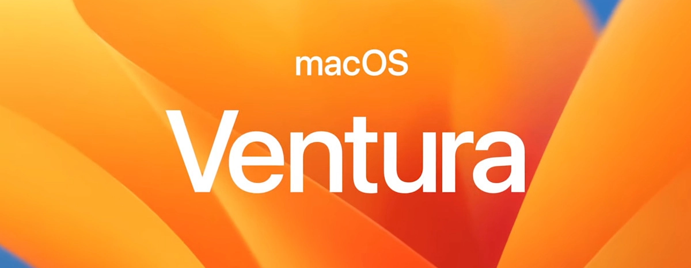
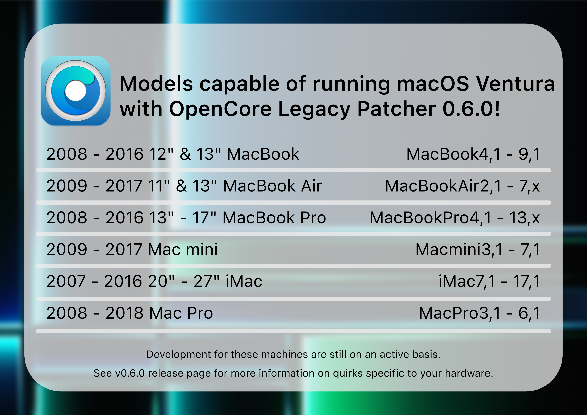

With the release of OpenCore Legacy Patcher 0.5.0, support for macOS Ventura has been implemented. This page informs about regarding issues.

## Newly dropped hardware

MacOS Ventura's release dropped a large amount of Intel hardware, thus requiring the usage of OpenCore Legacy Patcher on the following models (in addition to previously removed models):

* iMac16,1 (21.5-inch, Late 2015)
* iMac16,2 (21.5-inch and 21.5-inch 4K, Late 2015)
* iMac17,1 (27-inch 5K, Late 2015)
* MacBook9,1 (12-inch, Early 2016)
* MacBookAir7,1 (11-inch, Early 2015)
* MacBookAir7,2 (13-inch, Early 2015)
* MacBookPro11,4 (15-inch, Mid 2015, iGPU)
* MacBookPro11,5 (15-inch, Mid 2015, dGPU)
* MacBookPro12,1 (13-inch, Early 2015)
* MacBookPro13,1 (13-inch, Late 2016)
* MacBookPro13,2 (13-inch, Late 2016)
* MacBookPro13,3 (15-inch, Late 2016)
* Macmini7,1 (Late 2014)
* MacPro6,1 (Late 2013)

## Current status

For older hardware, see below sections:

* [Currently Unsupported/Broken Hardware in macOS Ventura](#currently-unsupportedbroken-hardware-in-macos-ventura)
  * [AMD Polaris, Vega and Navi support on Mac Pros and pre-2012 iMacs](#amd-polaris-vega-and-navi-support-on-mac-pros-and-pre-2012-imacs)
  * [USB 1.1 (OHCI/UHCI) Support](#usb-11-ohciuhci-support)

The team is doing their best to investigate and fix the aforementioned issues, however no estimated time can be provided.

## Currently Unsupported/Broken Hardware in macOS Ventura

### AMD Polaris, Vega and Navi support on Mac Pros and pre-2012 iMacs

For users with 2008 to 2013 Mac Pros (MacPro3,1-6,1) and 2009 to 2011 iMacs (iMac9,1-12,2), keep in mind that macOS Ventura now requires [AVX2.0 support in the CPU](https://en.wikipedia.org/wiki/Advanced_Vector_Extensions#Advanced_Vector_Extensions_2) for native graphics acceleration. Thus while your GPU may be natively supported, you can't run macOS Ventura officially with these GPUs.

* CPUs supporting AVX2.0 are Haswell or newer, which no pre-2019 Mac Pros can be upgraded with.

Currently at this time, OpenCore Legacy Patcher only supports patching the AMD Polaris and Vega Graphics stack to no longer require AVX2.0. We're recently received an AMD RX 6600 donation, so hopefully in the future the project can support AMD Navi with pre-Haswell Macs. However, no time estimates can be given.

Following GPUs are applicable:

| GPU Architecture | Model Families                | Support                                                   |
|------------------|-------------------------------|-----------------------------------------------------------|
| AMD Polaris      | RX 4xx/5xx (10/20 series)     | Supported with patching |
| AMD Vega         | Vega 56/64/VII (10/20 series) | ^^                                                        |
| AMD Navi         | RX 5xxx/6xxx (10/20 series)   | Unsupported                |

### USB 1.1 (OHCI/UHCI) Support

For Penryn systems and pre-2013 Mac Pros, USB 1.1 support was outright removed in macOS Ventura. While USB 1.1 may seem unimportant, it handles many important devices on your system. These include:

* Keyboard and Trackpad for laptops
* IR Receivers
* Bluetooth

OpenCore Legacy Patcher has basic support via Root Volume patching. However due to this, users will need to use a USB hub for installation and post-OS updates when patches are cleaned:

::: warning The following systems rely on USB 1.1

* iMac10,x and older
* Macmini3,x and older
* MacBook7,x and older
* MacBookAir3,x and older
* MacBookPro7,x and MacBookPro5,x and older
* MacPro5,x and older

:::
