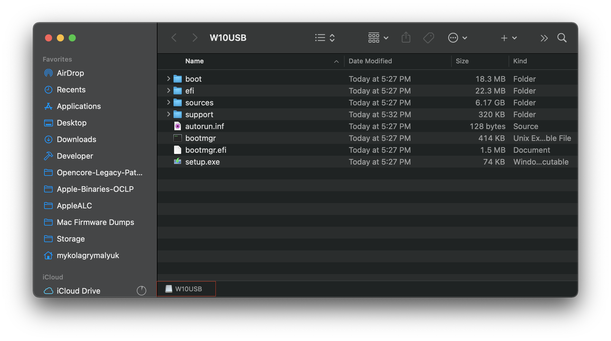

# Installing UEFI Windows 10

* Guide based off of [cdf's Mac Pro Thread](https://forums.macrumors.com/threads/opencore-on-the-mac-pro.2207814/)

To install UEFI is actually super simple! All it requires is to boot Windows' Installer through OpenCore to force a UEFI setup. Here we'll be going a bit more step by step in the process including partitioning and such.

* Note: UEFI Windows is generally quite usable for Arrendale and newer models, however machines with Penryn CPUs may experience issues
* Recommended Models:
  * MacBookAir4,x and newer
  * MacBookPro8,x and newer
  * Macmini5,x and newer
  * iMac11,x and newer
  * MacPro4,1 and newer
  * Xserve3,1 and newer

Once you know your model is supported, you're good to go with the rest of this guide

## Disk Formatting

To start off, we'll need the following:

* An 8GB USB drive for the Windows Installer
* Minimum of 30GB of free space on whatever drive you want to install Windows too

First, lets format out drives as follows:

### USB Drive Formatting

Open Disk Utility in macOS and format the USB Drive as ExFat with MBR Scheme:


### Disk Formatting

Next, grab the drive you wish to install Windows on and partition it as ExFat (If formatting entire drive, ensure it's GUID Partition Table):


If you plan to use the same hard drive for macOS and Windows, we recommend creating a dedicated partition just for OpenCore. This lets Windows have the ESP to itself and OpenCore can stay within it's own bubble.

Recommended size is 200MB and the partition format **must** be FAT32 for OpenCore to operate correctly. You will next want to install OpenCore onto the new partition, either moving from the ESP with [MountEFI](https://github.com/corpnewt/MountEFI) or rerunning the OpenCore-Patcher.app

* Note: For machines with dedicated drives for Windows, having different partitions for OpenCore is not required
* Note 2: We recommend uninstalling OpenCore from the ESP/EFI Partition when you create this new OpenCore partition to avoid confusion when selecting OpenCore builds in the Mac's boot picker


## Creating the Installer

First up, lets grab Windows's Installer at the below link:

* [Download Windows 10 Disc Image (ISO File)](https://www.microsoft.com/en-ca/software-download/windows10ISO)

Next, mount the Windows 10 ISO:


The open terminal and run `rsync` on the USB drive (replace CCCOMA_X64 with the mounted ISO's name, as well as replacing W10USB with your USB drive's name):

```
rsync -r -P /Volumes/CCCOMA_X64/ /Volumes/W10USB
```


Command will take some time, so sit back and get some coffee. Once finished, the root of the USB drive should look as follows:

* Ensure that these folders and files are on the root, otherwise the USB will not boot



Once done, lets reboot into OpenCore's Menu and you'll see a new Windows' entry:

* Note: Do not boot the installer outside of OpenCore as this will default back to the old MBR BIOS setup. Booting through OpenCore ensures Windows uses UEFI


From there, install Windows as normal and you'll get a new BootCamp entry in OpenCore's picker when done! 

* Don't forget to run BootCamp's utilities installer as well to ensure Wifi and such are functioning correctly. This can be downloaded from the BootCamp Assistant app in macOS


## Troubleshooting

### iMac12,x Bluescreen after driver installation

Currently Intel's iGPU drivers for the HD 3000 series do not support UEFI booting in Windows. Recommended solution is to simply disable: [iMac 12,1 Windows 10 Boot Loop – Fix Intel Graphics issue](https://zzq.org/?p=39)
